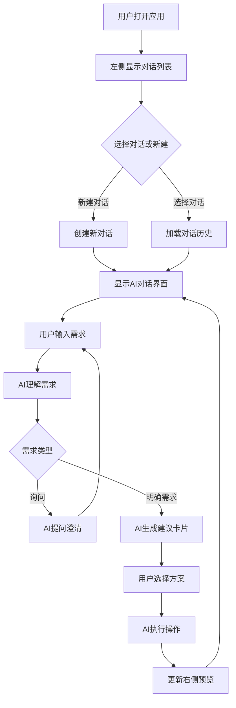

# AI 驱动的写作系统设计文档

## 1. 产品概述

重构现有的小说写作系统，从以功能为中心的界面转变为以AI对话为核心的自然语言写作环境。所有功能都通过AI对话交互完成，让用户通过对话就能傻瓜式地完成全部写作工作。

- 目标：消除复杂的界面操作，通过自然语言对话控制整个写作系统
- 价值：降低使用门槛，让AI成为真正的创作合作伙伴

## 2. 核心功能

### 2.1 对话系统重构

| 功能模块 | 描述 |
|---------|------|
| 对话卡片系统 | AI建议和选择通过对话卡片的方式呈现 |
| 多轮对话管理 | 支持创建、切换、删除不同的对话主题 |
| 对话历史管理 | 左侧对话列表，记录所有对话历史 |
| 上下文关联 | 对话内容与项目状态自动关联 |

### 2.2 左侧文件结构重构

```
📁 项目名
├── 📁 对话（新功能）
│   ├── 日常创作对话
│   ├── 剧情构思对话
│   ├── 角色设计对话
│   └── ...
├── 📁 核心
│   └── 概览
├── 📁 角色
│   ├── 人物
│   └── 关系网络
├── 📁 故事
│   ├── 情节线
│   ├── 大纲
│   ├── 转折点
│   └── 时间线
├── 📁 世界
│   └── 世界观
├── 📁 写作
│   └── 章节
└── 📁 工具
    ├── 一致性检查
    ├── 读者体验
    ├── Story Graph
    └── 使用日志
```

### 2.3 AI 能力扩展

AI可以完成的任务：
- 项目管理：创建项目、修改项目信息
- 角色管理：创建角色、修改角色信息、设置关系
- 世界观管理：创建、编辑世界观设定
- 故事管理：创建情节线、大纲、转折点、时间线
- 章节管理：创建章节、编辑内容、删除章节
- 内容优化：修改描写、扩展场景、续写内容
- 智能建议：提供多种选择方案，用户通过卡片选择

## 3. 核心流程



## 4. 用户界面设计

### 4.1 设计风格
- 保持现有 VS Code 风格深色主题
- 左侧：对话和文件混合显示
- 中间：AI对话界面（核心）
- 右侧：内容预览和编辑
- 配色：现有配色方案保持不变

### 4.2 页面布局

| 区域 | 宽度 | 功能 |
|------|------|------|
| 左侧栏 | 260px | 对话列表 + 文件浏览器 |
| 中间栏 | 400px | AI对话界面（核心） |
| 右侧栏 | 剩余空间 | 内容预览和编辑区（支持tab） |

### 4.3 对话卡片设计

AI的建议以对话卡片的形式呈现：

```
┌─────────────────────────────────┐
│ 我为你提供了3个方案，请选择：     │
├─────────────────────────────────┤
│ [方案A卡片] [方案B卡片] [方案C] │
│ ····                    ····    │
│ 标题：激情打斗场景       取消   │
│ 描述：双方激烈交锋...    等等…   │
│                                   │
│ [✓ 选择此方案] [✗ 重新提议]       │
└─────────────────────────────────┘
```

## 5. 数据模型设计

### 5.1 对话模型

```typescript
interface Conversation {
  id: string
  projectId: string
  title: string
  type: 'general' | 'character' | 'plot' | 'world' | 'chapter' | 'outline'
  createdAt: Date
  updatedAt: Date
  messages: Message[]
}

interface Message {
  id: string
  role: 'user' | 'assistant'
  content: string
  timestamp: Date
  actions?: AssistantAction[]
  cards?: ChoiceCard[]
}

interface ChoiceCard {
  id: string
  title: string
  description: string
  content?: any
  actionType: string
}
```

### 5.2 API 设计

```typescript
// 对话相关 API
POST /api/v1/projects/:projectId/conversations
GET /api/v1/projects/:projectId/conversations
POST /api/v1/projects/:projectId/conversations/:id/messages
POST /api/v1/projects/:projectId/conversations/:id/cards/:cardId/select
```

## 6. 实施计划

### 阶段一：基础架构（1-2小时）
- 创建对话数据模型和API
- 修改左侧栏，添加对话列表
- 创建对话管理组件

### 阶段二：对话系统升级（2-3小时）
- 升级AI对话，支持对话卡片
- 添加对话选择、切换功能
- 实现对话上下文管理

### 阶段三：AI能力扩展（3-4小时）
- 扩展AI可处理的任务范围
- 实现项目管理、角色管理等通过对话操作
- 添加智能建议和选择功能

### 阶段四：整合和优化（1-2小时）
- 整合所有功能
- 用户体验优化
- 测试和调试

## 7. 技术架构保持不变

- 前端：React 18 + TypeScript + Vite
- 后端：NestJS
- 数据库：SQLite（现有）
- 状态管理：React Query
- UI：Tailwind CSS + 自定义组件
